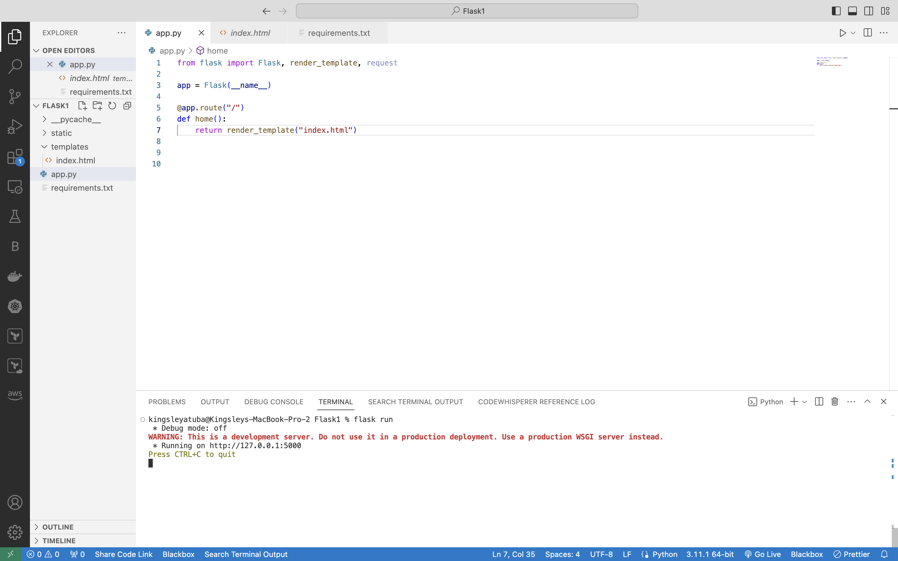
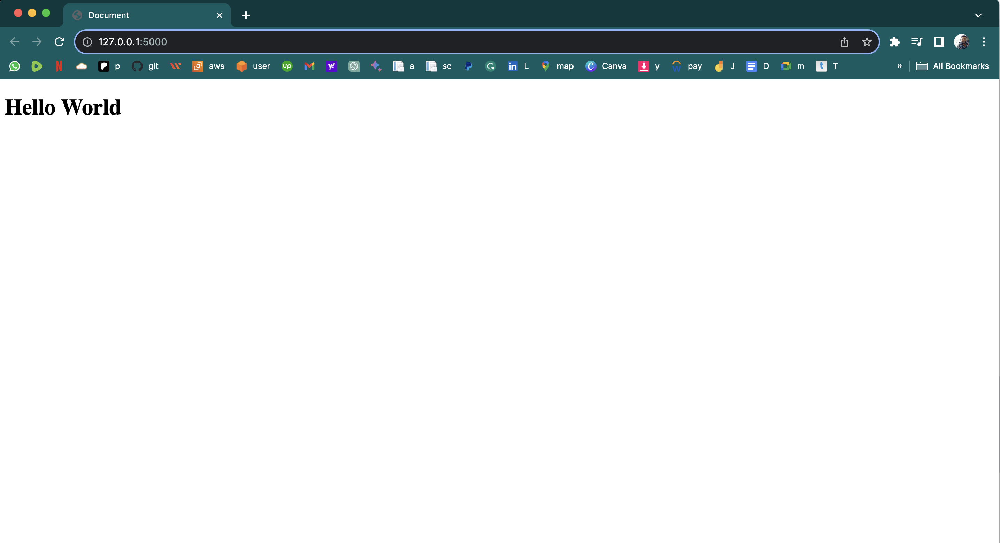
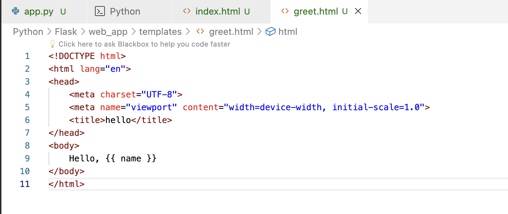
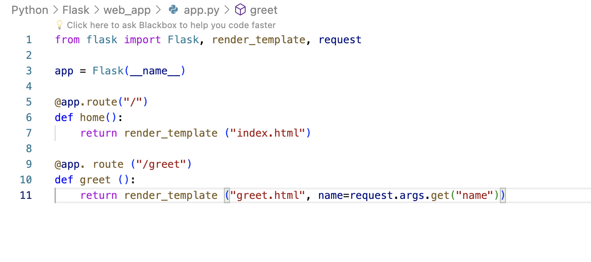
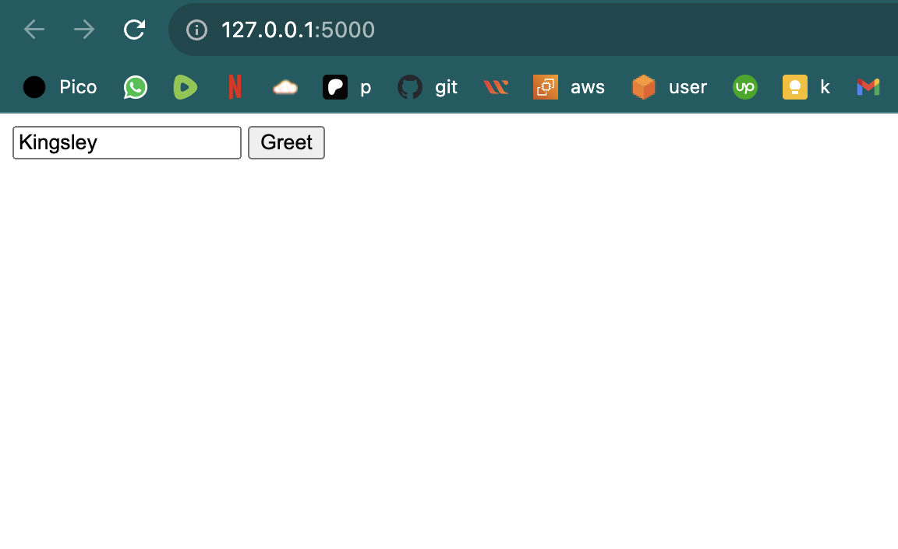
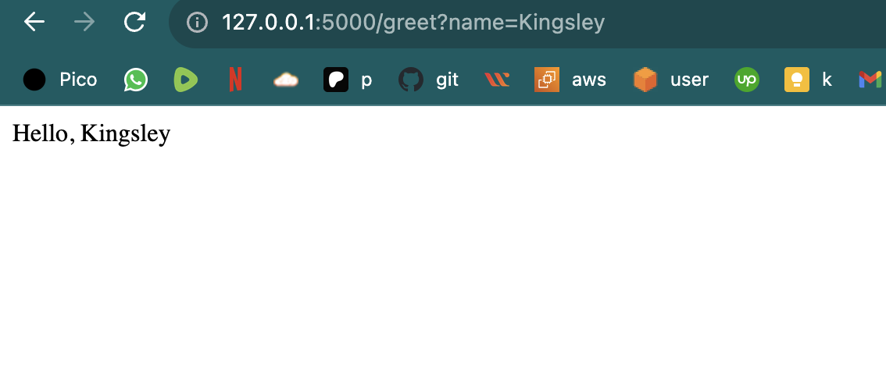

# Building a Flask Application from Scratch

## Step 1

## Step 2

## Step 3

## Step 4

## Step 5

## Step 6

Create a form

## Step 7

## Step 8

Create greet.html in template directory

## Step 9

Update app.py

## Step 10

Run the application using `flask run` and visit the provided url

## Step 11

Type in a name

==

## Step 12

## Step 13

Introducing Jinja Template

## Step 14

## Step 15

## Step 16

Repeat step 10, 11 and 12 again to confirm that Jinja works

